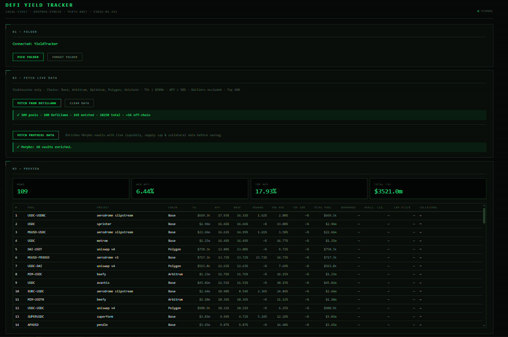
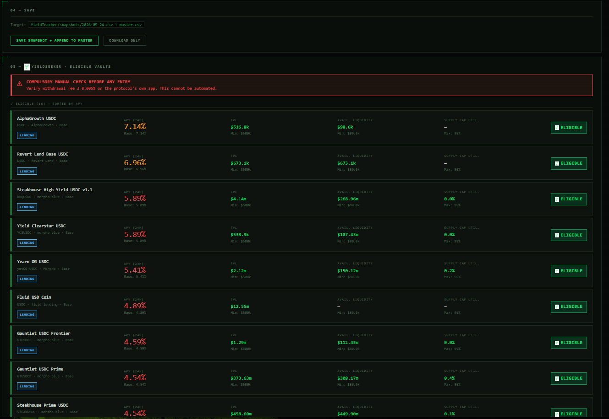
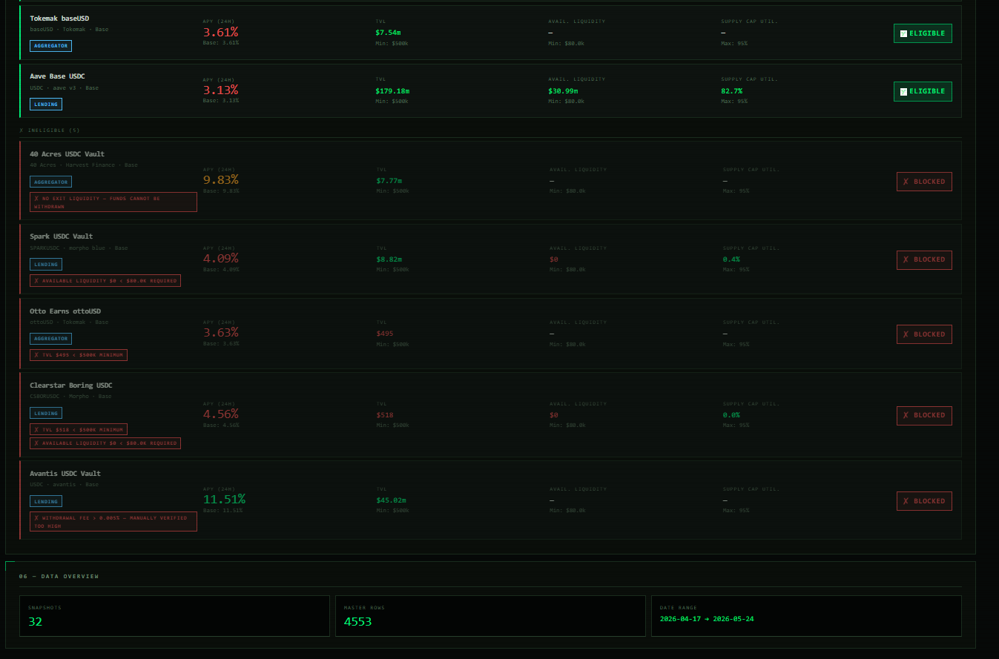
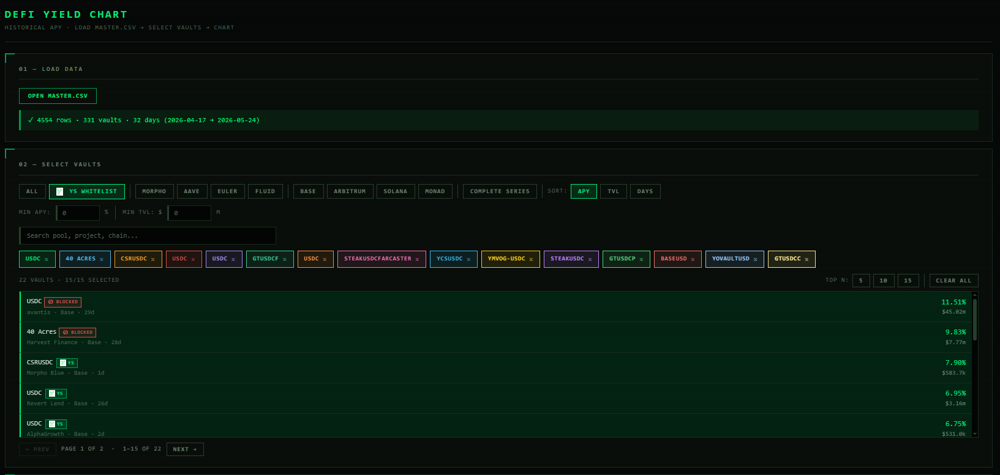
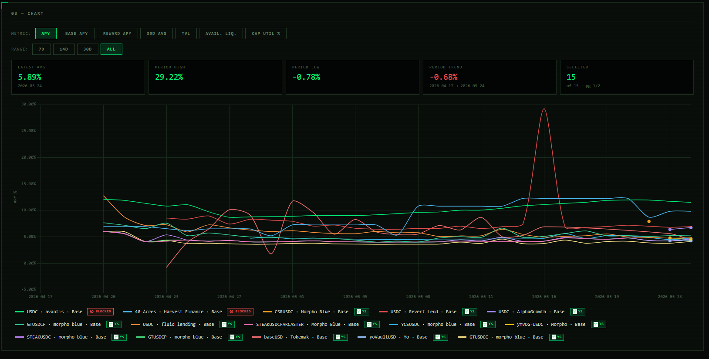

# DeFi Yield Tracker

**[→ Open in browser](https://knotnumb.github.io/YieldTracker/)** &nbsp;·&nbsp; Chrome or Brave required &nbsp;·&nbsp; no install needed

[](https://github.com/knotnumb/YieldTracker/actions/workflows/pages.yml)

A local-first stablecoin yield monitoring tool. Pull live data from DefiLlama, enrich it with on-chain protocol data, and build a private time-series of the stablecoin yield market — all from a single HTML file with no server, no build step, and no API keys required.

Built around the vault selection maintained by **[ YieldSeeker](https://www.yieldseeker.xyz/)** — and easily adapted to track any set of protocols you care about.

---

## What it does

- Fetches filtered stablecoin yield data from the **DefiLlama API** on demand
- Enriches **Morpho vaults** with live supply cap utilisation, available liquidity, and collateral breakdowns via the Morpho API
- Reads **on-chain APY and liquidity** directly from ERC4626 vault contracts for protocols not listed on DefiLlama
- Flags vaults against a configurable watchlist — pre-loaded with the **YieldSeeker** curated selection (marked  YS)
- Saves each daily fetch as an append-only CSV time-series you own and control
- Includes a separate **historical chart viewer** (`chart.html`) for visualising APY trends across any vaults in your dataset

---

## Screenshots

### Yield Tracker

**Fetch & preview** — connect a folder, pull live DefiLlama data, and preview the enriched results table:



**YieldSeeker panel** — eligible vaults ranked by APY with liquidity and supply-cap status:



**Blocked vaults & data overview** — ineligible entries with block reasons, plus snapshot/master counts:



### Chart Viewer

**Vault selection** — filter by protocol, chain, or YS whitelist; sort by APY, TVL, or history length:



**APY time series** — up to 15 vaults overlaid, multiple metrics, selectable date ranges:



---

## Why local-first?

- **No account, no subscription, no cloud** — your data lives in a folder you pick
- Sync to Dropbox, Google Drive, or OneDrive if you want backup and multi-device access
- The HTML files run directly from `file://` — nothing to install or deploy

---

## Requirements

- **Browser:** Chrome or Brave (requires the File System Access API — Firefox does not support it)
- **Brave users:** two one-time steps, **in this order**:
  1. Go to `brave://flags/#file-system-access-api`, set it to **Enabled**, and **relaunch Brave**. This turns the API on — without it the picker button does nothing.
  2. Then go to `brave://settings/content/filesystem` and allow file system access. This is the per-site permission.

That is all. No Node.js, no Python, no API keys.

---

## Quick start

1. **[Open the app](https://knotnumb.github.io/YieldTracker/)** in Chrome or Brave — no download needed
2. **[Download the starter folder](https://knotnumb.github.io/YieldTracker/YieldTracker.zip)** — extract it to Documents (or a Dropbox/Drive folder for automatic sync)
3. Click **Pick Folder** and select the unzipped `YieldTracker` folder
4. Click **Fetch from DefiLlama** — pulls filtered stablecoin yield data from the DefiLlama API
5. Click **Fetch Protocol Data** — enriches results with Morpho API data and on-chain vault reads
6. Click **Save Snapshot + Append to Master** — writes today's snapshot and appends to `master.csv`

### Want the chart tool working straight away?

The [`master.csv`](master.csv) in this repo is an ongoing public dataset with months of stablecoin yield history. Drop it into your unzipped `YieldTracker` folder (replacing the empty one from the starter pack) before connecting the folder in the app — the chart viewer will have real data from day one.

1. Download [`master.csv`](master.csv) from this repo *(Raw → Save As)*
2. Save it into your `YieldTracker` folder, replacing the empty starter one
3. Open `chart.html`, click **Open master.csv**, and navigate to your `YieldTracker` folder

---

## Daily workflow

### 1 — Fetch from DefiLlama

Click **Fetch from DefiLlama**. The tracker calls the DefiLlama yields API with your configured filters and populates the preview table.

Default filters (adjustable in `config.json`):

| Filter | Default |
|---|---|
| Asset type | Stablecoins only |
| Chains | Base, Arbitrum, Optimism, Polygon, Unichain |
| Min TVL | $500k |
| Max APY | 50% |
| Row limit | 100 |
| Exclude outliers | Yes |

### 2 — Fetch Protocol Data

Click **Fetch Protocol Data**. This runs three enrichment passes:

**Morpho vaults** — queries the Morpho API for any Morpho vaults in your results and adds:
- Available liquidity (remaining withdrawal/deposit capacity)
- Supply cap utilisation %
- Collateral exposure breakdown

**Off-chain vaults** — for vaults not indexed by DefiLlama (or where on-chain data is more reliable), the tracker reads directly from the contract:
- **ERC4626 share-price APY** — compares `convertToAssets()` at current block vs ~7 days ago (falls back to 24 hours) and annualises the growth rate; the 7-day window smooths out autopool harvest-day spikes
- **Euler interest-rate APY** — reads the live borrow rate, utilisation, and protocol fee directly from the Euler V2 vault contract
- **Available liquidity** — reads the underlying token balance held by the vault

**Aave V3 Base** — queries on-chain for USDC supply APY and liquidity.

### 3 — Check  YieldSeeker panel

The **YieldSeeker** panel (section 05) automatically filters the enriched results against the pre-configured vault watchlist. Each eligible vault shows its APY, TVL, available liquidity, and supply cap status. Vaults flagged as operationally blocked (e.g. no exit liquidity) are shown with a ⊘ marker.

> YieldSeeker curates a selection of stablecoin yield vaults focused on capital safety and exit liquidity. Learn more at [yieldseeker.xyz](https://www.yieldseeker.xyz/).

### 4 — Save

Click **Save Snapshot + Append to Master**. This:
- Writes `snapshots/YYYY-MM-DD.csv` — the raw day's data
- Appends all rows to `master.csv` — the append-only time-series

---

## Historical chart viewer

Open `chart.html` separately in the same browser. Click **Open master.csv** and navigate to your data folder.

**Selecting vaults:**
- Filter by protocol or  YS whitelist status; independent chain selector stacks on top
- Set minimum APY and TVL thresholds
- Search by name
- Sort by APY, TVL, or days of history
- Use **Top 5 / 10 / 15** buttons to auto-select the highest-ranking vaults from the current filter
- Page through results (15 per page)
- Each row has a "↗" link to that protocol's page on [DefiLlama](https://defillama.com) (opens in a new tab)

**Charting:**
- Up to 15 vaults simultaneously
- Metrics: APY, Base APY, Reward APY, 30d Average, TVL, Available Liquidity, Supply Cap Util %
- Date ranges: 7d, 14d, 30d, All
- Hover over legend names to isolate a single series

---

## Customising your watchlist

The pre-loaded watchlist tracks the YieldSeeker vault selection. To build your own:

### Adding on-chain vaults (not on DefiLlama)

Edit the `OFFCHAIN_VAULTS` array in `tracker.html`. Each entry needs:

```javascript
{
  name: 'My Vault',
  address: '0x...',                    // vault contract address
  network: 'base',                     // network slug (for future use)
  chain: 'Base',                       // display chain name
  project: 'My Protocol',             // display project name
  pool: 'USDC',                        // display pool name
  matchRe: { project: /myprotocol/i }, // regex to detect if DL already has it
  erc4626: {
    rpc: 'https://base.drpc.org',
    decimals: 6,
    shareApy: true   // use share-price APY (most ERC4626 vaults)
    // eulerApy: true  // use Euler V2 interest-rate model instead
  },
  liquidityRpc: {                      // optional: on-chain liquidity read
    rpc: 'https://base.drpc.org',
    token: '0x833589fCD6eDb6E08f4c7C32D4f71b54bdA02913', // underlying token
    decimals: 6
  }
}
```

### Adding watchlist rules

Edit the `YS_VAULTS` array. Each rule is a set of regex conditions — a vault matches if all specified conditions match:

```javascript
{ pool: /mypool/i, project: /myprotocol/i, chain: /base/i }
```

Add `blocked: true` to mark a vault as ineligible (shown in the YS panel with a ⊘ warning rather than hidden).

### Adjusting DefiLlama filters

Edit `config.json` in your data folder (created automatically on first run). The file is excluded from git — your overrides are local only.

```json
{
  "defiLlama": {
    "chains": ["Base", "Arbitrum", "Optimism"],
    "minTvl": 1000000,
    "maxApy": 30,
    "limit": 50,
    "stablecoinOnly": true,
    "excludeOutliers": true
  }
}
```

---

## master.csv schema

20 columns, append-only. Do not edit directly. If opening in Excel, choose **Don't Save** when closing.

| Column | Description |
|---|---|
| `date` | YYYY-MM-DD |
| `rank` | APY rank on that day |
| `pool` | Pool name |
| `project` | Protocol name |
| `chain` | Blockchain |
| `tvl` | TVL display string |
| `tvl_raw` | TVL as a number (USD) |
| `apy` | Total APY % |
| `base_apy` | Base/native APY % |
| `reward_apy` | Incentive APY % |
| `base_apy_7d` | 7-day base APY % |
| `il_7d` | 7-day impermanent loss % |
| `avg_30d` | 30-day average APY % |
| `inception_apy` | APY since inception % |
| `top_10_pct` | Top 10% APY threshold on that day |
| `total_pool` | Total pool size (USD) |
| `total_borrowed` | Total borrowed (USD) |
| `avail_liquidity` | Available liquidity (USD) — Morpho vaults: `Σ min(vaultSupplyInMarket, marketIdleCash)`; blank for Morpho rows before 2026-05-25 (historical values corrected) |
| `supply_cap_util` | Supply cap utilisation % (Morpho vaults) |
| `collateral_exposure` | JSON collateral breakdown (Morpho vaults) |

---

##  About YieldSeeker

[YieldSeeker](https://www.yieldseeker.xyz/) curates a selection of stablecoin yield vaults with a focus on capital safety, withdrawal liquidity, and sustainable APY. The  YS badge in this tracker marks vaults that meet the YieldSeeker criteria. The ⊘ Blocked badge marks vaults that are monitored but currently excluded due to operational concerns such as illiquid exit conditions.

This tracker was built to support the YieldSeeker research workflow. The vault list, enrichment logic, and YS panel reflect the criteria applied at [yieldseeker.xyz](https://www.yieldseeker.xyz/).

---

## Data and privacy

- `master.csv` contains only public market data (APYs, TVLs, pool names scraped from DefiLlama and public APIs). No wallet addresses, no personal positions, no account data.
- All data is stored locally in the folder you choose.
- The tracker makes outbound API calls to DefiLlama, the Morpho API, and public blockchain RPC endpoints. No data is sent to any other service.
- `config.json` is excluded from git (see `.gitignore`). It contains only DefiLlama filter settings — no secrets.

---

## Troubleshooting

**Brave asks for folder permission every session**
→ Expected when running from `file://`. Not an issue when using the hosted version at GitHub Pages. Click **Reconnect** at the top of the tracker to re-grant access.

**Pick Folder does nothing / file system access blocked in Brave**
→ Brave ships with the File System Access API **disabled**, so the picker never opens. Fix it in two steps, in order:
1. Go to `brave://flags/#file-system-access-api`, set it to **Enabled**, and **relaunch Brave**. (This is the real gate — the settings step below does nothing until this flag is on.)
2. Go to `brave://settings/content/filesystem` and allow file system access.

**Fetch Protocol Data shows 0 Morpho vaults enriched**
→ Check your internet connection. The Morpho API is public and requires no authentication.

**Save fails with a file lock error**
→ `master.csv` is open in Excel or another application. Close it and try again. Do not open `master.csv` in Excel while the tracker is running.

**Chart shows a gap in a vault's history**
→ DefiLlama has changed pool naming conventions twice: qualifiers moved from `POOL / qualifier` → `POOL|qualifier` → plain `POOL`, and project name casing shifted to lowercase in May 2026. The chart normalises all of these automatically via a `KEY_ALIASES` map. If you still see a gap, check the vault list for a second entry with a slightly different name — they may need an alias added in `chart.html`.

**Protocol link (↗) goes to a 404 on DefiLlama**
→ The link is built from the `project` field (e.g. "Aave V3" → `defillama.com/protocol/aave-v3`). Some protocols have since been renamed/rebranded on DefiLlama, or off-chain vault rows use a shorthand project name. Add an override to the `PROTOCOL_SLUG_ALIASES` map in `chart.html`.

---

## Architecture notes

Both `tracker.html` and `chart.html` are self-contained single-file vanilla JS applications. There is no build step, no npm, no bundler, and no external dependencies beyond Chart.js (loaded from CDN in `chart.html`).

File I/O uses the browser's [File System Access API](https://developer.mozilla.org/en-US/docs/Web/API/File_System_API) — files are read and written directly to your local folder without any server involvement.

To modify the tracker: edit `tracker.html` in any text editor. There is nothing to compile or build. Hard-reload the browser (Ctrl+Shift+R) after saving.

---

[](https://hits.sh/github.com/knotnumb/YieldTracker/)

## License

MIT — do whatever you like with it.
